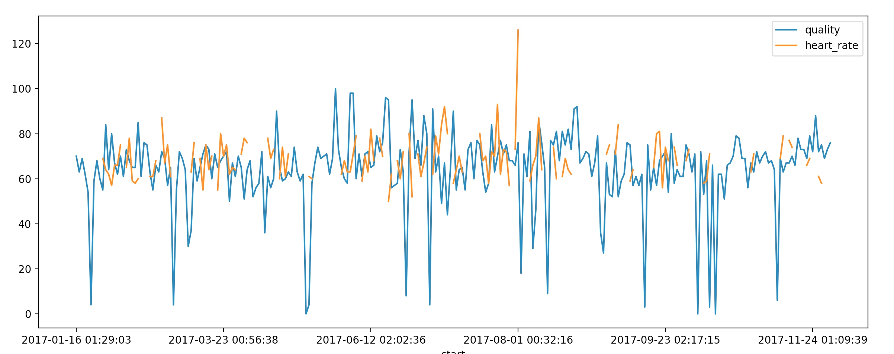
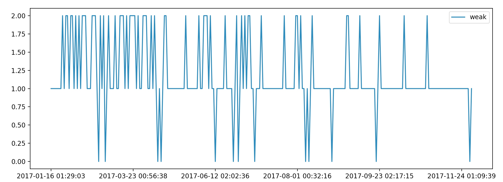
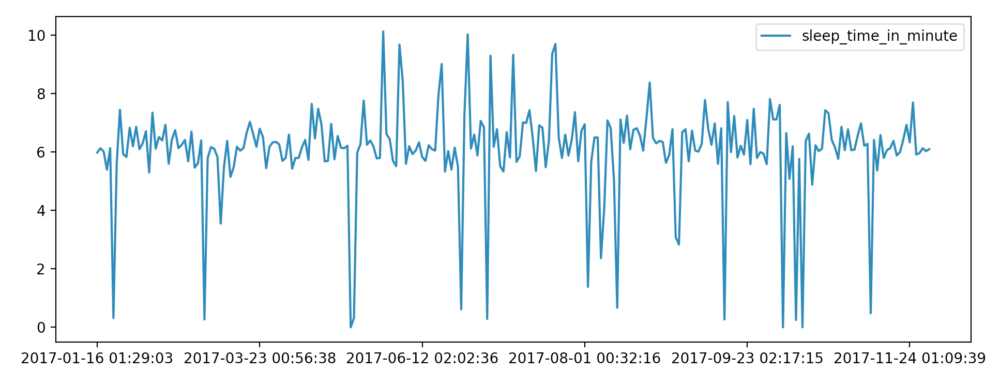

尝试画出使用 Sleep Cycle 今年统计的睡眠数据：

上图是睡眠质量和起床心率的统计，睡眠质量似乎不太乐观。很长一段时间处于一种相对焦虑的状态。

关于起床心情，一直没有能够坚持做到每天记录，默认没有记录的心情为一般。得分 0 为 `:(` 沮丧，得分 1 为一般，得分 2 为感觉不错。看来起床气没有想象中的重。

睡眠时间，普遍维持在 6 小时左右。如果中午没有访客，可以在会议室午睡半小时，大大缓解一下困意。

