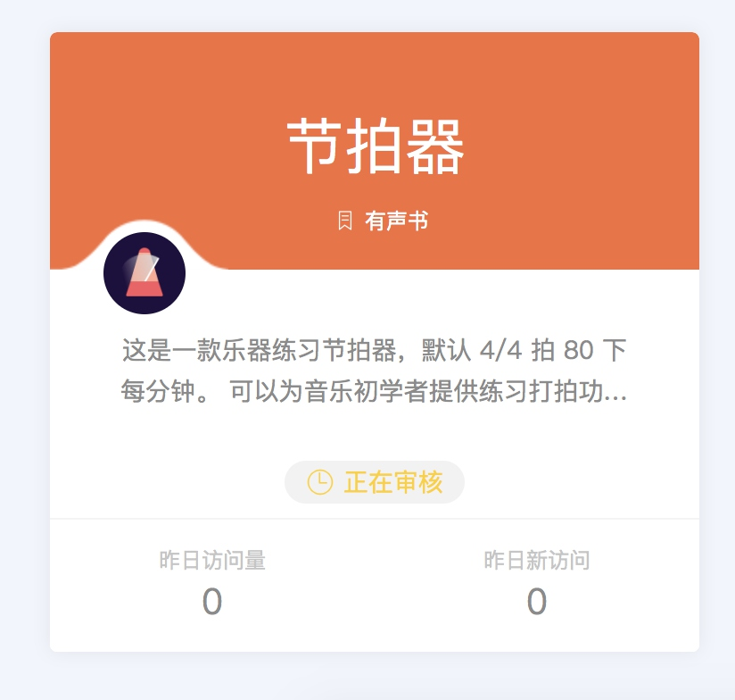
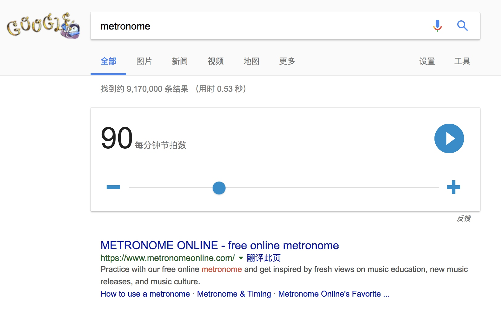
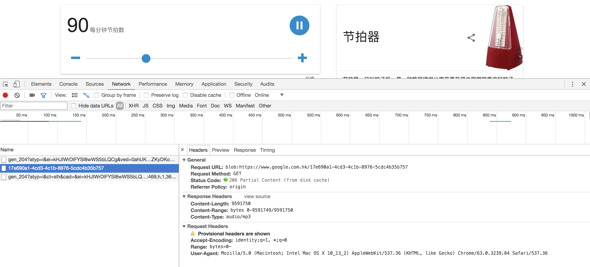

最近出差很久，昨天刚回来，双十一买的天猫精灵这几天才到。今天纠结了一下到底是开包装用起来还是闲鱼卖了换个小爱同学，后来想了想销量以及公司业务主要上的平台，还是开封留下来实际生活中体验一下吧。（小米的小爱同学顶部设计有点丑...）

总体来说感觉还可以。午饭后 L 练琴的时候，问天猫精灵能不能打节拍来提供练琴的辅助，天猫精灵官方还没有这个技能，于是看了一下官方的文档，惊喜的发现现有的后台就可以支持添加这样的功能。于是新建一个技能折腾折腾试试。



网上找了一下相关的节拍器音频，效果都不太好，后来发现，谷歌搜索官方有一个不错，大改是这样的：



一开始以为这个可以调整节奏的是前端生成的（根据一个固定的短音频），查看网络请求，发现是后台生成的：



接下来，与 L 测试了一下所需的节奏。目前她练习的主要是 4/4 拍，节奏不要太快，选定了每分钟 80 下的。于是使用一串 JS 将这个 blob 数据下载下来：

```JS
var link = document.createElement("a"); // Or maybe get it from the current document
link.href = 'blob:https://www.google.com.hk/17e690a1-4cd3-4c1b-8976-5cdc4b35b757';
link.download = "aDefaultFileName.mp3";
link.innerHTML = "Click here to download the file";
document.body.appendChild(link);
```

提交到天猫精灵，按照文档简单配置，测试是否可用，体验神马的...

[视频演示](http://oleywo6g9.bkt.clouddn.com/天猫精灵节拍器1.0.0.MOV)

OK，大功告成，画个图标，提交上架审核试试 ^_^。

