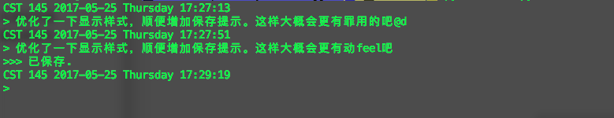

CST 145 2017-05-25 Thursday 17:00:35
> 尝试做一个随时记录想法的小脚本，自动保存到日志目录。

CST 145 2017-05-25 Thursday 17:01:06
> 看起来目前是可用状态的说

CST 145 2017-05-25 Thursday 17:05:56
> 这个小脚本大概是我第三个用 编写的小程序。感觉压力小很多，想起什么就记录一下比开启一个书写好多了。

CST 145 2017-05-25 Thursday 17:07:16
> 志斌今天和我们说他要离职了，感觉好快。内心有点复杂，想了不少东西。在工作上，这半年来我自己内心也是比较挣扎的。

CST 145 2017-05-25 Thursday 17:12:00
> 似乎终端输入中文有点问题

CST 145 2017-05-25 Thursday 17:20:40
> 在终端下使用 raw_input 方法获取用户输入内容的时候，会遇到删除字符（中文）实际删除与显示不相符的情况，暂时还没有搜索到解决办法，考虑加一个判定方式，如果最后结尾输入 @d，那么就放弃这句话的记录。

CST 145 2017-05-25 Thursday 17:27:51
> 优化了一下显示样式，顺便增加保存提示。这样大概会更有feel吧

CST 145 2017-05-25 Thursday 17:50:48
> 今天悠闲了大半天，不过也没有做什么一直想做的周边项目，考虑到晚上要赶回去上之前报名的课程，下午补了一下Python的相关基础知识...最近一年业余时间写程序比较多，理解起来一门陌生语言不是那么困难了。感觉已经渐渐克服了之前因为某些原因写东西不自信的感觉（有点类似恐惧）。

CST 145 2017-05-25 Thursday 17:51:50
> 久违的等下班...有点颓废的感觉。

CST 145 2017-05-25 Thursday 17:52:54
> 刚才听到黄工在办公室沟通关于小组出方案的事情（似乎是和上海那边），心慌，有点感觉是把我们往火坑里推（资源不齐备的情况/或者说特别缺乏的情况下）...

