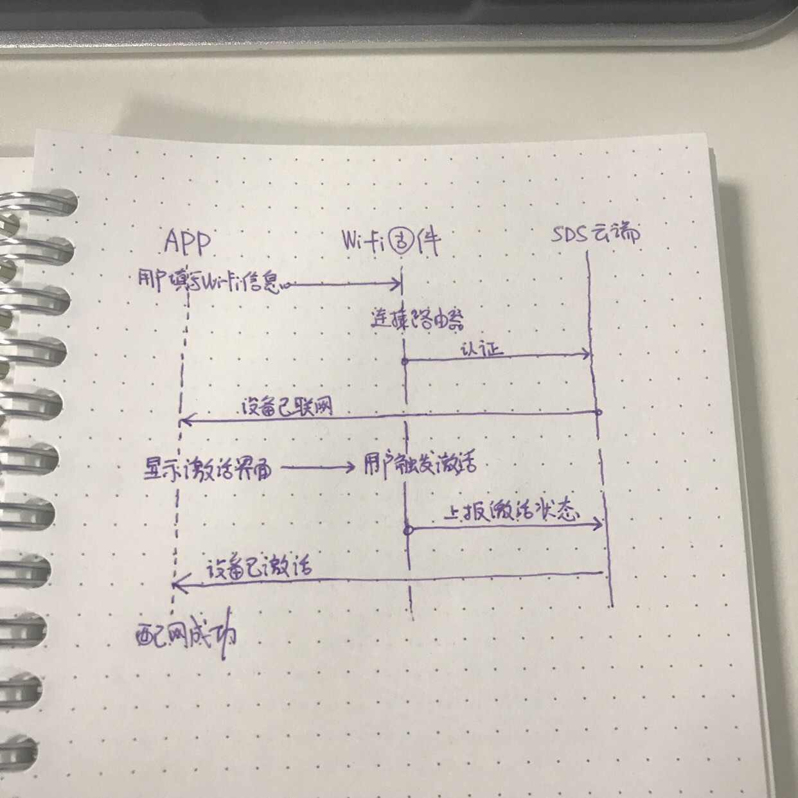

早上难得在八点三十左右就出了家门（平时是八点四十多）。考虑到今天下午要去拜访客户，于是特地带了钱包（里面有七毛钱，一张五毛的、两张一毛的，主要是里面会有几张名片，随身带着比较方便），但是忘记拿旁边的公交卡与门禁卡，平时只带后者。冲到地铁过了安检才发现没有带卡，只得逆着人流爬上来去骑车，卡点到。

紧接着抓紧搜了一下 adb 命令，花了接近一上午时间对安卓抓取日志。昨天客户（金稻）反馈的最终用户无法配网的问题实在是比较纠结。我们发现之前在做产品实现决策的时候有一个巨大的失误：我们默认整个配网认证流程，三端（手机应用、固件、云端）的交互过程是没有阻塞的，于是做了配网成功后 3 秒自动上报激活状态的所谓「自动激活」机制。然而问题就出在这里，根据目前开放出的 API 与阿里提供的 BoneKit 配网界面推测配网内部逻辑如下：

当网络延迟比较大的情况下，若在 app 判断当前设备联网成功前，设备上报了激活状态，那么整个系统是不认定用户对设备操作进行了激活的。也就是说，一定要在 app 认定当前设备联网成功，可进入设备激活状态的时候，才可以进行激活操作。

与阿里的同学确认确实由于上述问题导致后，只得与客户沟通，先尝试采用引导用户手动激活的方式是否可以解决。办公室用开发版验证了一下是可以解决的。老金下午忙没有时间，看是要晚上验证一下，明早问问了。

- - - - - -

下午到拜访一家比较有理想的客户，开头还是有点懵逼的，自从转部门之后，很少有这样的机会直接面对实际有需求的客户做面对面沟通，感觉作为偏研发和实现的部门，还是应该多与客户接触一下好一些。有些时候我们想提供的，与客户想要的，实在是差别很大。看到客户的实现方式与设计，对我个人来说还是有一些小冲击的。（实实在在，出货。）