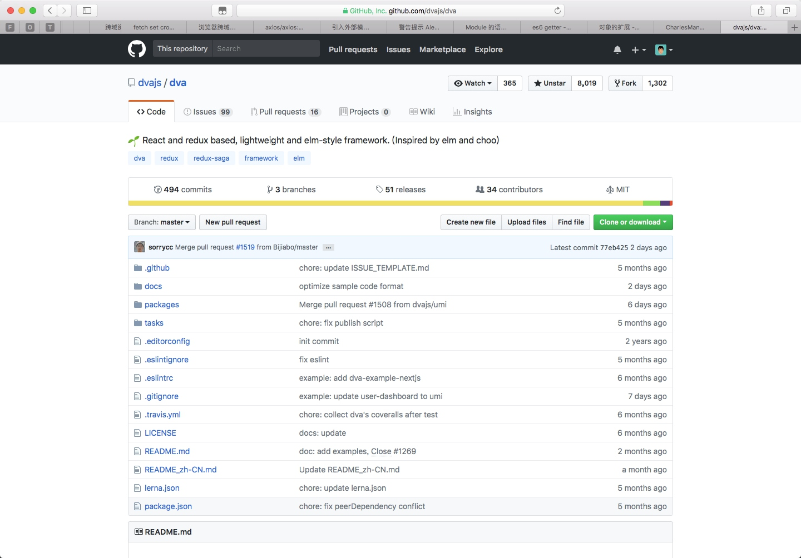

## dva
最近开始用 pro.ant.design 作为后台开发，因为有不少困惑（越来越跟不上前端的节奏了），看了一下 dva 这个框架的文档。顺便发现一个文档格式问题，顺手修改提了一个 pull request，昨天被合并了，开心 :)

## 工作
昨天整理了一下文档，关于年后单品方案开发流程的，暂定命名为 2.0。感觉有不少大的变动，我觉得总体来说大的方向是没有问题的，不过涉及到今年上半年的招人计划以及上海、深圳两地的协作方式，感觉还是略纠结，估计还要再迭代两个版本。纠结是不是先给远松看下。

年前最后一天上班，纠结下午是不是开溜买点年货，估计大家都走的差不多了。